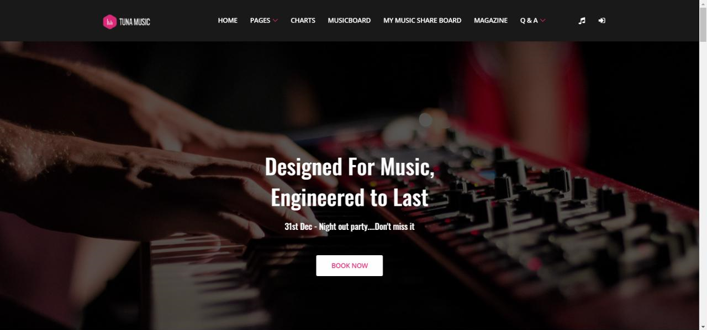
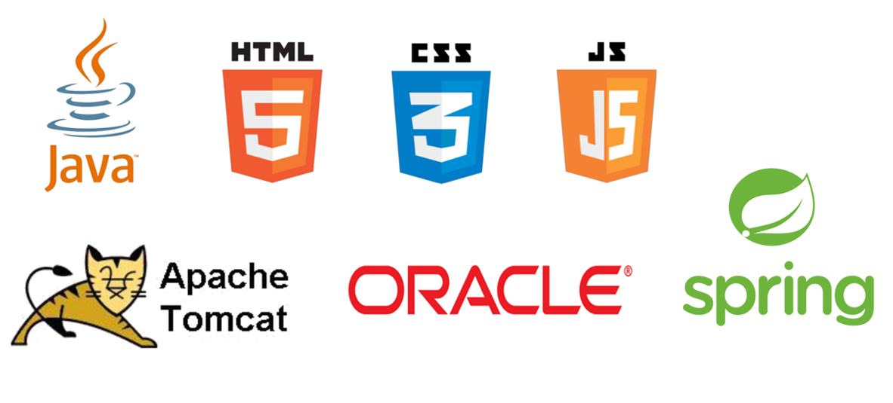

# FinalProject: TunaMusic
2019.09.22 ~ 2019.10.31 from KHAcademy

 

## 1. 프로젝트 소개

Spring 웹 프로젝트, 이용권을 결제하여 음악을 다운 받는 기존의 음악 사이트와 크라우드 펀딩을 결합하여 회원이 직접 참여할 수 있는 사용자 위주 사이트를 개발하고자 했다.
 

### 1.1 프로젝트 내용
- 회원관리
    - 마이페이지
    - 회원가입
    - 회원정보 수정 및 찾기
    - 유료로 기능 제한

- 음악 업로드 게시판
    - 차트 포함
    - 플레이어, 플레이리스트

- 크라우드 펀딩 게시판
    - 펀딩 프로젝트 등록 및 후원(결제)

- 음악 매거진 게시판,
    - 매거진 게시물 등록, 수정, 삭제, 확인

- 결제
    - 이용권 결제 (결제 후 사이트 이용 권한 부여)

 

### 1.2. 개발 환경 및 언어

 

 

### Database setting
Run dbquery.sql file on sqldeveloper.
